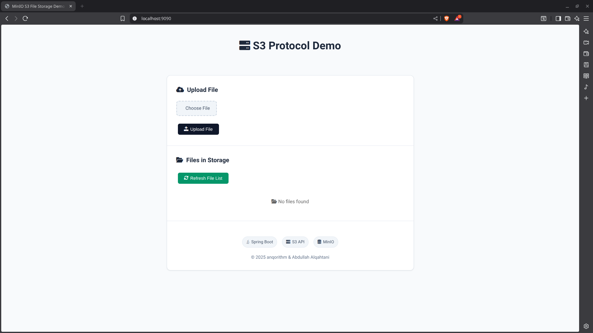
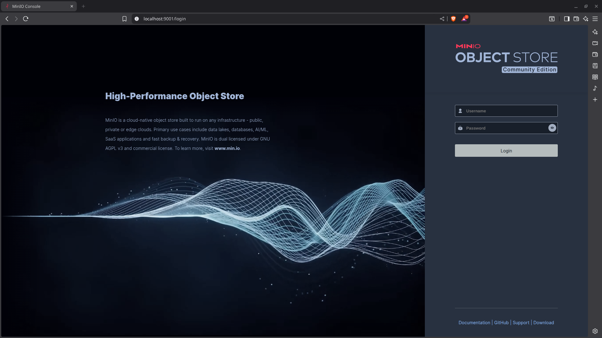
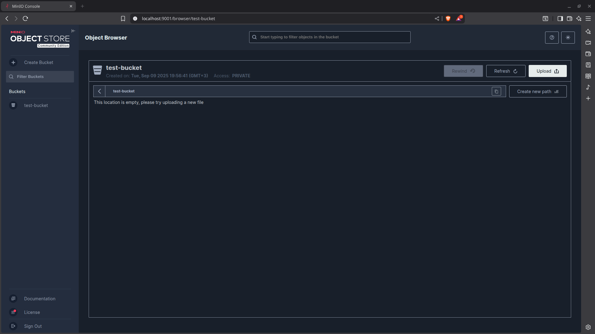
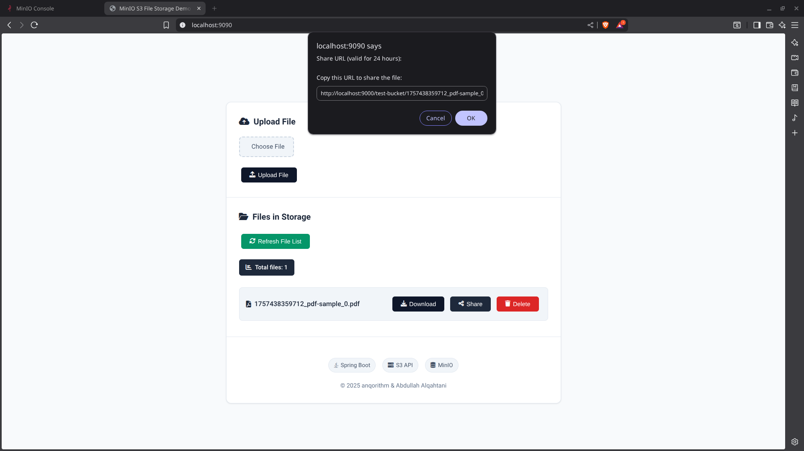
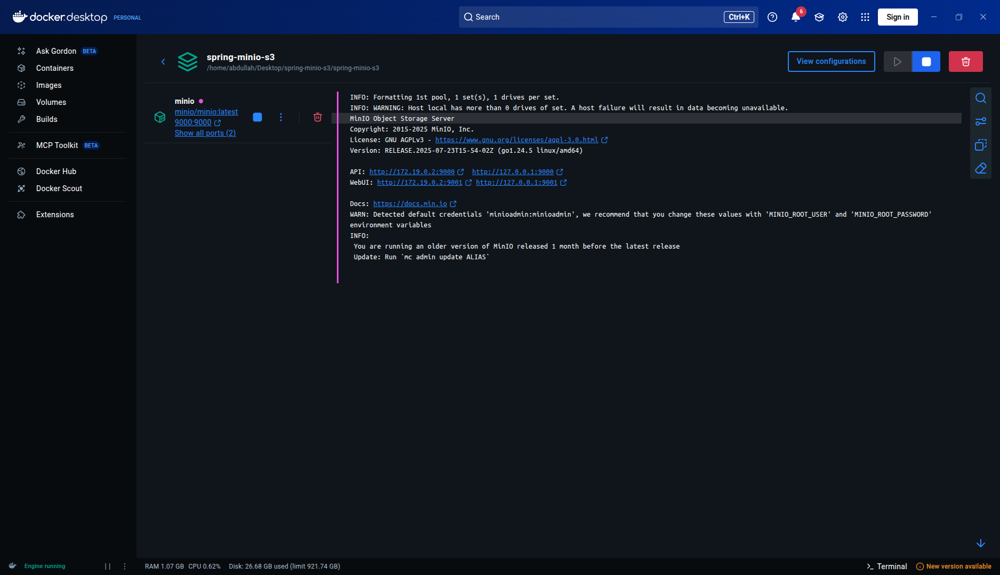

# Spring Boot & MinIO S3

[](https://opensource.org/licenses/MIT)
[]()
[]()
[](https://github.com/google/styleguide)
[](https://www.docker.com/)
[](https://docs.docker.com/compose/)
[](https://min.io/)

A simple Java Spring Boot application demonstrating file operations using the S3 API with a self-hosted MinIO server.

## The Core Idea

The **S3 API** is the industry standard for object storage. While originally from AWS, its API is open and can be implemented by other services.

**MinIO** is a popular open-source server that implements the S3 API. This allows you to develop applications using the well-known S3 protocol against a local, private storage instance, giving you a cloud-like development experience without depending on a cloud provider.

This project shows how a Java application can use a standard S3 client to perform file operations against a self-hosted MinIO server.

## POC


*The main page of the web application, ready for file uploads.*


*The MinIO Object Browser showing the initial empty 'test-bucket'.*


*After uploading a file through the web interface.*


*The MinIO console now shows the newly uploaded object in the bucket.*



*An example of interacting with the REST API using a cURL command.*

## Getting Started

### Prerequisites

- Java 17+
- Apache Maven 3.6+
- Docker & Docker Compose

### 1. Launch MinIO Server

This command starts a local, S3-compatible server.

```bash
docker-compose up -d
```

- **MinIO Console:** `http://localhost:9001` (Credentials: `minioadmin` / `minioadmin`)
- **S3 API Endpoint:** `http://localhost:9000`

### 2. Run the Spring Boot Application

This command starts the Java application.

```bash
mvn spring-boot:run
```

The application's web interface is now available at `http://localhost:8080`.

## How It Works

The Spring Boot application is configured to communicate with the MinIO server.

### Configuration

The connection is defined in `src/main/resources/application.properties`:

```properties
# MinIO Server Configuration
minio.endpoint=http://localhost:9000
minio.access-key=minioadmin
minio.secret-key=minioadmin
minio.bucket-name=test-bucket
```

### API Endpoints

The application exposes a REST API to demonstrate the S3 operations:

| Method | Endpoint                       | Description                               |
|--------|--------------------------------|-------------------------------------------|
| POST   | `/api/files/upload`            | Uploads a file.                           |
| GET    | `/api/files/download/{fileName}` | Downloads a file.                         |
| GET    | `/api/files/url/{fileName}`    | Generates a temporary link for a file.    |
| DELETE | `/api/files/{fileName}`        | Deletes a file.                           |
| GET    | `/api/files/list`              | Lists all files in the bucket.            |

## Stopping the Environment

To shut down the MinIO server:

```bash
docker-compose down
```

To stop the server and delete all stored data:

```bash
docker-compose down -v
```

## Resources

- **[MinIO Documentation](https://min.io/docs/minio/linux/index.html)**: Official documentation for the MinIO server.
- **[MinIO Java SDK Examples](https://github.com/minio/minio-java/tree/master/examples)**: Code examples for the Java client used in this project.
- **[Spring Boot Documentation](https://spring.io/projects/spring-boot)**: Official documentation for the Spring Framework.
- **[AWS S3 Documentation](https://aws.amazon.com/s3/getting-started/)**: Learn more about the concepts of the original S3 service.
